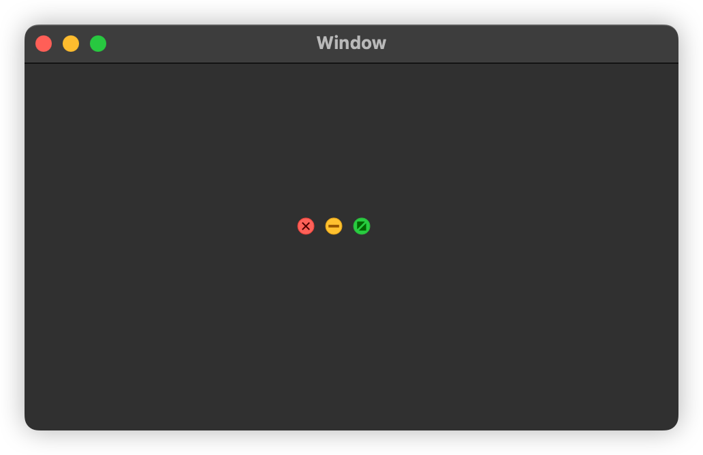

<p align="center">

</p>

<p align="center"> <b> LCWindowButton is a framework for customizing NSWindow's zoom in, close, zoom out, and full screen buttons!</b></p>


<a href="https://twitter.com/LiuChuan_"></a>
</p>


## How to use

```swift
let windowButtonView = LCWindowOperateView(buttonTypes: [.close, .mini, .fullScreen])

view.addSubview(windowButtonView)
 
```


### Design
 


## Installation

### CocoaPods
PermissionsKit is available through [CocoaPods](https://cocoapods.org). To install it, simply add the following line to your Podfile:

```swift

pod 'LCWindowButton'

```


### SwiftPackage

Add `https://github.com/DevLiuSir/LCWindowButton.git` in the [“Swift Package Manager” tab in Xcode](https://developer.apple.com/documentation/xcode/adding_package_dependencies_to_your_app).


## License

MIT License

Copyright (c) 2024 Marvin


## Author

| [](https://github.com/DevLiuSir)  |  [DevLiuSir](https://github.com/DevLiuSir)<br/><br/><sub>Software Engineer</sub><br/> [][1] [][2] [][3]|
| :------------: | :------------: |

[1]: https://twitter.com/LiuChuan_
[2]: https://github.com/DevLiuSir
[3]: https://devliusir.com/